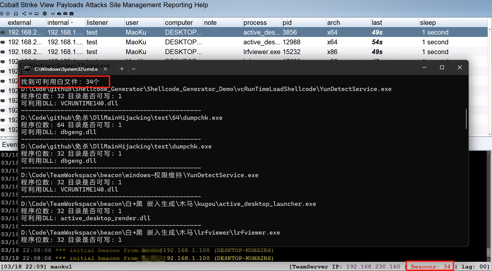

# DllMain Hijacking
 

Automatically search for available white files on the local machine, high accuracy, simple operation

### 项目演示
https://github.com/Neo-Maoku/SearchAvailableExe/assets/26914648/72d7a8f6-c846-4dc8-af19-e8d2e41e7b79

### 项目适配测试

- 在win11 64、win10 64、win7 64、win7 32、server 2008 64系统中均测试成功，准确率高

  

### 项目使用vs 2022编译

- 项目包括一个可执行文件和加载Shellcode的测试DLL项目，在dllmain.cpp文件中替换自己的shellcode，再编译dll，把生成32位和64位dll放到可执行文件的同目录下。

### 使用说明

-o：运行输出日志文件存放位置，默认是输出到控制台

-i：指定搜索的目录位置，需要是目录。默认是全盘搜索

-w：搜索的可利用白文件目录是否具有可写权限，默认为否

-c：搜索的可利用白文件需要依赖几个Dll文件，默认为1。系统dll不包括在内

-b：指定搜索的可利用白文件是否为32或64位，默认搜索32和64位程序

-s：是否保存搜索到的可利用文件临时目录，默认为否

-l：过滤dll加载方式，1是静态加载，2是动态加载，3是静态加动态。默认值为3

B站地址：

【一款自研的自动化挖掘白利用程序工具】 https://www.bilibili.com/video/BV1bm421n73Z/?share_source=copy_web&vd_source=c75cdcc6b49a06fd849f2d392e8e3218
